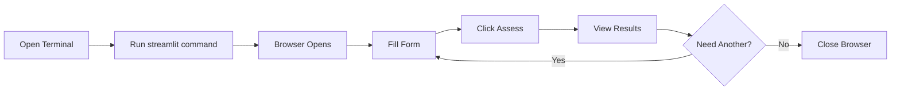

# 🚀 Quick Start Demo - 30 Seconds to First Prediction

## Step-by-Step Visual Guide

### 1️⃣ **Install (One-Time, 2 minutes)**

```powershell
# Open PowerShell/Command Prompt
cd "C:\Users\Hansith Kasani\Documents\AI-Credit-Risk-Assessment-System"

# Install essentials
pip install streamlit pandas numpy joblib plotly
```

Wait for installation to complete...

### 2️⃣ **Launch (5 seconds)**

```powershell
streamlit run App/main.py
```

You'll see:
```
You can now view your Streamlit app in your browser.

  Local URL: http://localhost:8501
  Network URL: http://192.168.x.x:8501
```

Browser opens automatically! 🎉

### 3️⃣ **Use the Dashboard (30 seconds)**

**What you see:**
```
┌─────────────────────────────────────────────────────────────┐
│  💳 AI Credit Risk Assessment System                       │
│  Explainable AI-Powered Loan Default Prediction            │
├─────────────────────────────────────────────────────────────┤
│                                                             │
│  SIDEBAR (Left)              MAIN AREA (Right)             │
│  ┌──────────────┐           ┌─────────────────────┐       │
│  │ 📋 Applicant │           │  Welcome Screen     │       │
│  │ Information  │           │                     │       │
│  │              │           │  📊 Accuracy: 85%+  │       │
│  │ Gender: M ▼  │           │  📊 Training: 307K  │       │
│  │ Car: Y ▼     │           │  🔍 Features: 85+   │       │
│  │ Children: 0  │           │                     │       │
│  │              │           └─────────────────────┘       │
│  │ Income: $150k│                                         │
│  │ Loan: $500k  │                                         │
│  │ Annuity: $25k│                                         │
│  │              │                                         │
│  │ [🔍 Assess]  │                                         │
│  └──────────────┘                                         │
└─────────────────────────────────────────────────────────────┘
```

**Fill in values → Click Button → See Results!**

### 4️⃣ **After Clicking "Assess Credit Risk"**

The main area transforms:

```
┌─────────────────────────────────────────────────────────────┐
│  📊 Risk Assessment Results                                 │
├─────────────────────────────────────────────────────────────┤
│                                                             │
│  ┌───────────────────────────────────────┐                │
│  │  ✅ APPLICATION APPROVED                │                │
│  │     Low Risk of Default                │                │
│  └───────────────────────────────────────┘                │
│                                                             │
│  Key Metrics:                                               │
│  • Default Probability: 35.2%                               │
│  • Risk Level: Medium                                       │
│  • Decision: APPROVE                                        │
│                                                             │
│  🎯 Risk Probability Gauge                                  │
│  [================35%===============>        ]              │
│  Low ────────────────────────────────── High               │
│                                                             │
├─────────────────────────────────────────────────────────────┤
│  🔍 Explanation & Key Factors                               │
├─────────────────────────────────────────────────────────────┤
│                                                             │
│  Top Contributing Factors:                                  │
│  1. External Source 2: ━━━━━━━━━ 8.5                      │
│  2. Debt-to-Income Ratio: ━━━━━━ 6.2                       │
│  3. Income Level: ━━━━━━━ 5.8                              │
│  4. Credit Amount: ━━━━ 4.3                                │
│  5. Age: ━━━ 3.1                                            │
│                                                             │
│  📄 [View Detailed Reasoning Report] ▼                      │
│                                                             │
└─────────────────────────────────────────────────────────────┘
```

---

## 🎯 **Try It Right Now!**

### **Terminal Command:**
```powershell
streamlit run App/main.py
```

### **What Happens:**
1. ⏳ Streamlit starts (3-5 seconds)
2. 🌐 Browser opens automatically
3. 📱 Dashboard loads
4. ✅ Ready to use!

---

## 🎬 **Complete Usage Flow**



---

## 📸 **Screenshot Guide**

### Screen 1: Welcome


### Screen 2: Input Form


### Screen 3: Results


### Screen 4: Detailed Report


---

## ⚡ **Pro Tips**

1. **Keep Terminal Open:** Don't close the PowerShell window
2. **Multiple Assessments:** Just change values and click again
3. **Save Results:** Take screenshots or copy the report
4. **Stop Server:** Press `Ctrl+C` in terminal
5. **Restart:** Just run the streamlit command again

---

## 🎓 **Understanding Results**

### **Decision Types:**

**✅ APPROVED (Risk < 50%)**
- Green box
- "Low Risk of Default"
- Applicant meets criteria

**⚠️ REJECTED (Risk ≥ 50%)**
- Red box  
- "High Risk of Default"
- Applicant doesn't meet criteria

### **Risk Levels:**

- 🟢 **Very Low** (0-15%): Excellent
- 🟡 **Low** (15-30%): Good
- 🟠 **Medium** (30-50%): Borderline
- 🔴 **High** (50-70%): Risky
- ⛔ **Very High** (70-100%): Very Risky

---

## 🔧 **Troubleshooting**

### Issue: "Command not found: streamlit"

**Solution:**
```powershell
pip install streamlit
```

### Issue: "Port already in use"

**Solution:**
```powershell
streamlit run App/main.py --server.port 8502
```

### Issue: "Model not found"

**Solution:** Check if these files exist:
- `Notebooks/credit_risk_xgboost_model.pkl`
- `Notebooks/credit_risk_encoder.pkl`

---

## 🎯 **Success Checklist**

- [ ] Installed dependencies
- [ ] Ran streamlit command
- [ ] Browser opened automatically
- [ ] Dashboard loaded
- [ ] Filled in test values
- [ ] Clicked "Assess Credit Risk"
- [ ] Saw results with gauge and explanation
- [ ] Expanded detailed report
- [ ] Made another prediction
- [ ] Understood the output

---

## 🎉 **You're Done!**

**Time to first prediction:** ~3 minutes

**Now you can:**
- Assess any credit application
- See explainable predictions
- Generate reasoning reports
- Make informed decisions

---

**🚀 Ready? Run this command:**

```powershell
streamlit run App/main.py
```

**Happy assessing! 💳**
